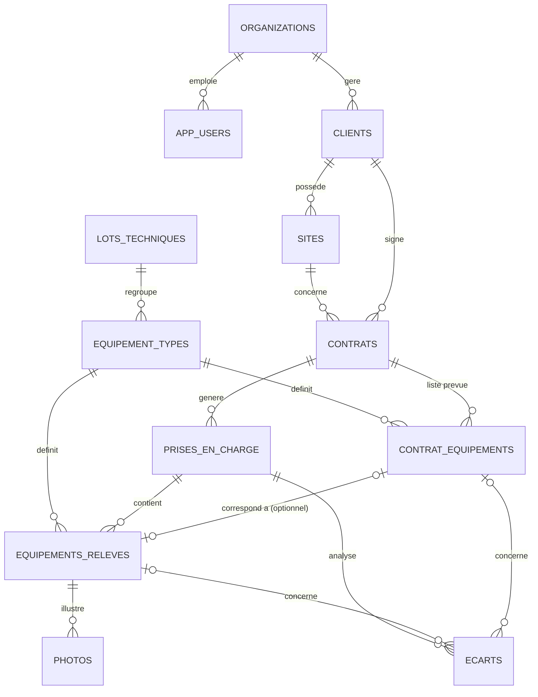

# Modèle de données — Prise en charge technique multi-tech

## Flux général

1. **PC — Préparation** : un préparateur crée une `prise_en_charge` à partir d'un `contrat`. Les `contrat_equipements` (pré-remplis lors de la création du contrat) servent de check-list de référence.
2. **Mobile — Relevé terrain** : le technicien récupère la prise en charge, voit la liste des équipements attendus (`contrat_equipements`), et crée un `equipement_releve` pour chacun (état, plaque signalétique, photos). Il peut aussi ajouter un `equipement_releve` avec `est_hors_contrat = true` pour du matériel non prévu au contrat.
3. **PC — Analyse** : une fois la prise en charge terminée, le préparateur/l'admin compare `contrat_equipements` ↔ `equipements_releves` pour générer les `ecarts` (manquants, hors contrat, état dégradé, points positifs) et rédige la synthèse (`synthese_points_forts` / `synthese_points_faibles`).

## Schéma (ERD)

## Points de conception importants

- **`est_hors_contrat`** distingue un équipement relevé qui correspond à une ligne du contrat (`contrat_equipement_id` renseigné) d'un équipement ajouté librement sur le terrain (`contrat_equipement_id` null). Une contrainte SQL empêche les deux à la fois.
- **Plaque signalétique dynamique** : plutôt que des colonnes fixes (qui varient énormément entre une chaudière, un TGBT ou un extincteur), `equipement_types.plaque_signaletique_schema` décrit les champs attendus par type d'équipement (clé, libellé, type, unité), et `equipements_releves.plaque_signaletique` stocke les valeurs saisies en JSONB. Le formulaire mobile se génère dynamiquement à partir de ce schéma.
- **Référentiel partagé** : `lots_techniques` et `equipement_types` avec `org_id = null` forment un catalogue commun (CVC, Électricité, Plomberie, SSI, Ascenseurs...) livré par défaut. Chaque organisation peut ajouter ses propres types (`org_id` renseigné) sans impacter les autres.
- **Mode hors-ligne mobile** : tous les identifiants sont des UUID générés côté client, donc l'app mobile peut créer des `equipements_releves` et `photos` sans connexion, puis les synchroniser plus tard. La résolution de conflit v1 est "dernière écriture gagne" via `updated_at` — à revoir si plusieurs techniciens interviennent sur la même prise en charge.
- **Isolation multi-organisation** : chaque table métier porte un `org_id` et une policy RLS Supabase restreint l'accès à l'organisation de l'utilisateur connecté (`current_org_id()`), pour héberger plusieurs entreprises clientes sur la même base si besoin.

## Référentiel technique initial (`0002_seed_referentiel.sql`)

Catalogue global (`org_id = null`) couvrant 6 lots et 24 types d'équipements, chacun avec son schéma de plaque signalétique dynamique :

| Lot | Types d'équipements |
|---|---|
| CVC | Chaudière, Pompe à chaleur, Centrale de traitement d'air, VMC, Groupe froid/Climatiseur |
| Électricité | TGBT, Armoire électrique divisionnaire, Groupe électrogène, Onduleur (ASI), BAES |
| Plomberie & Sanitaire | Ballon ECS, Surpresseur, Adoucisseur d'eau, Pompe de relevage |
| Sécurité Incendie | Centrale de détection (SDI/CMSI), Extincteur, Désenfumage, RIA |
| Ascenseurs & Levage | Ascenseur, Monte-charge, Porte automatique |
| Sûreté & Contrôle d'accès | Contrôle d'accès, Vidéosurveillance, Portail automatique |

Chaque organisation peut compléter ce référentiel avec ses propres types (`org_id` renseigné) sans toucher au catalogue partagé — utile pour du matériel spécifique à un client (ex : une chaudière industrielle sur-mesure).

## Ce qui n'est pas encore couvert (à décider plus tard)

- Gestion fine des droits (ex : un technicien ne voit que ses prises en charge assignées) — actuellement la RLS isole par organisation, pas encore par utilisateur/rôle sur les lectures.
- Historique/versioning des modifications sur un `equipement_releve` (audit trail).
- Notifications (prise en charge assignée, prise en charge terminée à valider).
